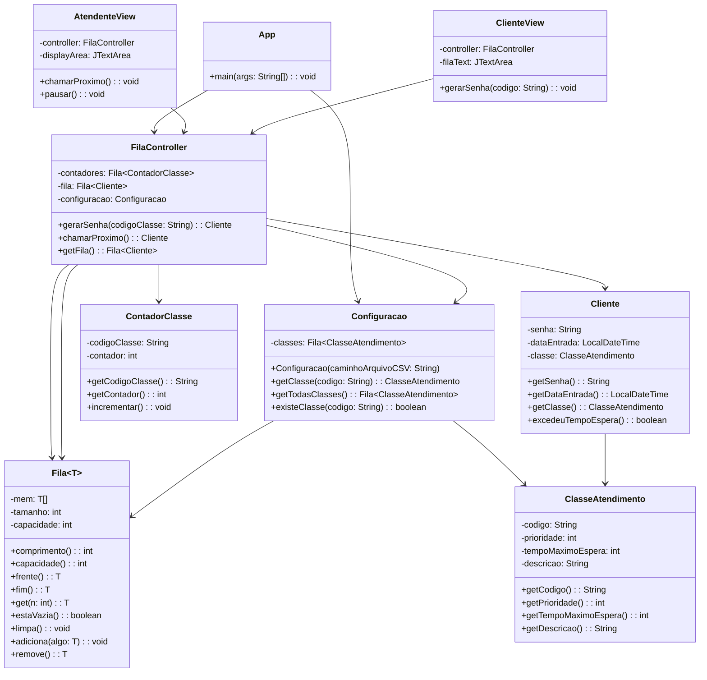

# Manual de Utilização do Sistema de Atendimento

## Visão Geral do Sistema

O sistema de atendimento implementado é composto por três módulos principais:
1. **Módulo de Configuração**: Carrega e gerencia as classes de atendimento
2. **Módulo de Controle**: Gerencia a fila de atendimento e a lógica de prioridades
3. **Módulo de Visualização**: Interfaces para clientes e atendentes

## Implementação das Operações Principais

### 1. Listar Classes de Atendimento

**Implementação**:
- As classes são carregadas do arquivo CSV no construtor da classe `Configuracao`
- Armazenadas em uma `Fila<ClasseAtendimento>`
- Cada classe contém: código, prioridade, tempo máximo de espera e descrição

**Estrutura de dados**: 
- Fila genérica (implementação customizada)
- Escolhida por ser adequada para sequências de elementos onde a ordem de inserção é importante

### 2. Adicionar Cliente à Fila de Atendimento

**Implementação** (método `gerarSenha` em `FilaController`):
1. Obtém a classe de atendimento pelo código
2. Cria ou atualiza o contador de senhas para a classe
3. Gera a senha no formato "CÓDIGO + NÚMERO" (ex: P001)
4. Cria um novo cliente com a senha, data/hora atual e classe
5. Adiciona à fila principal

**Estruturas de dados**:
- `Fila<Cliente>`: Armazena todos os clientes na ordem de chegada
- `Fila<ContadorClasse>`: Mantém contadores separados para cada classe
- Escolha justificada pela necessidade de manter a ordem de chegada e contabilizar senhas por classe

### 3. Obter Próxima Senha a Ser Atendida

**Implementação** (método `chamarProximo` em `FilaController`):
1. Verifica se a fila está vazia
2. Percorre todos os clientes para encontrar o mais prioritário:
   - Prioriza clientes que excederam o tempo máximo de espera
   - Dentro do mesmo nível de prioridade, considera:
     - Maior prioridade da classe (número menor)
     - Tempo de espera mais antigo
3. Remove o cliente selecionado da fila
4. Retorna o cliente para atendimento

**Estrutura de dados**:
- Fila principal (`Fila<Cliente>`) é percorrida sequencialmente
- Necessidade de percorrer toda a fila justifica a escolha de uma estrutura simples, embora menos eficiente para grandes volumes

## Diagrama de Classes

## Estruturas de Dados Utilizadas

1. **Fila Genérica (Fila<T>)**:
   - Implementação customizada com array dinâmico
   - Operações básicas: adiciona, remove, frente, fim
   - Escolhida por simplicidade e adequação ao problema

2. **ClasseAtendimento**:
   - Armazena configurações de cada classe (prioridade, tempo máximo etc.)
   - Permite fácil expansão para novas classes via arquivo CSV

3. **Cliente**:
   - Representa cada pessoa na fila com sua senha e dados de atendimento
   - Calcula automaticamente se excedeu tempo de espera

4. **ContadorClasse**:
   - Mantém contagem sequencial de senhas por classe
   - Garante números únicos e sequenciais para cada tipo de atendimento

## Considerações de Design

1. **Separação de Responsabilidades**:
   - Model (dados), View (interface), Controller (lógica) bem definidos
   - Facilita manutenção e extensão

2. **Extensibilidade**:
   - Novas classes de atendimento podem ser adicionadas via CSV
   - Lógica de prioridade centralizada no controller

3. **Melhorias Potenciais**:
   - Substituir Fila por PriorityQueue para melhor eficiência
   - Implementar persistência das filas
   - Adicionar logs de atendimento

O sistema oferece uma solução completa para gestão de filas de atendimento com prioridades, sendo flexível o suficiente para adaptações futuras.